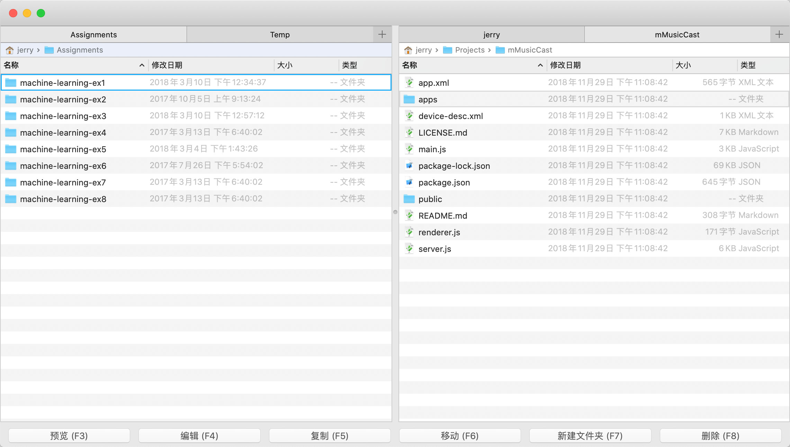

# Meili Commander

**Meili Commander** is a file management tool for macOS. Its dual-pane layout is inspired by Total Commander, and many of its keyboard shortcuts are borrowed from the Vim editor.

The Chinese word for “beautiful” is 美丽 — or *měilì* in Pinyin. **Meili Commander** is a fork of [_vCommander_](https://github.com/treblam/vCommander), originally created by [@treblam](https://github.com/treblam) from Shenzhen, China. I'm not Chinese, but I enjoy learning Mandarin, so *Meili* was chosen as a tribute to the original project and its creator.

Meili Commander's current features include:

- [X] Dual-pane layout  
- [X] Multi-tab interface  
- [X] Keyboard-centric design
- [ ] `#TODO` Support current [Apple Human Interface Guidelines](https://developer.apple.com/design/human-interface-guidelines/)
- [ ] `#TODO` Support current macOS styling, including Dark Theme

If you're a keyboard-focused user, you might enjoy this tool.

---

## 🛠 Development

- **Language**: Swift 5  
- **IDE**: Xcode 11.3  

---

## `#WIP` ⌨️ Keyboard Shortcuts

Meili Commander offers two modes:

- **Normal Mode**: For users unfamiliar with Vim
- **Vim Mode**: For Vim users and power keyboarders  

You can switch modes in **Settings**.

---

### 🔹 Normal Mode

#### ▸ Window Navigation

| `Tab`| Switch focus between left and right panes

#### ▸ File Operations

| `⌘` `O` | Open folder under cursor |
| `Enter` | |
| `→` | |
| `Backspace` | Go back to parent folder |
| `←` | |
| `↑`, `↓`| Move focus up |
| `↑`, `↓`| Move focus down |
| `Space`| Select file — supports multiple files selection |
| `⌘` `Enter` | Reveal in Finder |
| `⌘` `I`| File info |
| `F2`| Rename |
| `F3`| Preview | 
| `F4`| Edit — Set Editor in Settings |  
| `F5`| Copy to other pane |
| `F6`| Move to other pane |
| `F7`| New folder |
| `⇧` `F7`| New file |  
| `F8`| Delete |

#### ▸ Tab Management

| `⌘` `T`| New tab  
| `⌘` `W`| Close tab  
| `⌥` `⌘` `←` | Previous tab |
| `⌃` `⇧` `Tab`| |
| `⌥` `⌘` `→` | `⌃` `Tab`| Next tab  
| `⌥` `⌘` `→` | `⌃` `Tab`| Next tab  
| `⌘` `U`| Swap pane tabs  
| `⌘` `E`| Equalise both tabs  

#### ▸ Clipboard & Edit

| `⌘` `C`| Copy  
| `⌘` `V`| Paste  
| `⌘` `A`| Select all  
| `⌃` `⌘` `C`| Compare (set tool in Preferences)  

#### ▸ Folder Navigation

| `⇧` `⌘` `G`| Go to folder  
| `⇧` `⌘` `H`| Home
- `⇧-⌘-G`: Go to folder  
- `⇧-⌘-H`: Home  
- `⇧-⌘-D`: Desktop  
- `⇧-⌘-A`: Applications  
- `⇧-⌘-O`: Documents  
- `⇧-⌘-C`: Root  
- `⇧-⌘-L`: Downloads  
- `⇧-⌘-U`: Utilities  

#### ▸ Quick Search

- *Type filename*: Fuzzy match (Pinyin supported)  
- `ESC`: Clear input  

#### ▸ Favourites

- `⌘-D`: Open favourites  

---

### 🔸 Vim Mode

All standard shortcuts also work in Vim mode. The following **additional** Vim-style keys are available:

#### ▸ Navigation

- `h`: Go up  
- `l`: Open folder / file  
- `j`: Down (`10j` = 10x down)  
- `k`: Up  
- `gg`: First item  
- `G`: Last item  
- `Ngg` / `NG`: Go to Nth item  
- `M`: Middle of view  
- `H`: Top of view  
- `L`: Bottom of view  

#### ▸ File Actions

- `S`, `cc`: Rename (select all text)  
- `i`, `a`, `A`: Rename (cursor at end)  
- `I`: Rename (cursor at start)  
- `dd`: Delete item (supports repetition)  
- `d`: Delete selected items  
- `yy`: Copy item  
- `y`: Copy selected  
- `p`: Paste (supports repetition)  
- `/`: Search (supports Pinyin)  
- `⌘-n`: Next match  
- `⌘-p`: Previous match  

#### ▸ Tabs

- `gt`: Next tab  
- `gT`: Previous tab  

---

## 📜 License

Licensed under [GPL-3.0](https://www.gnu.org/licenses/gpl-3.0.en.html).

